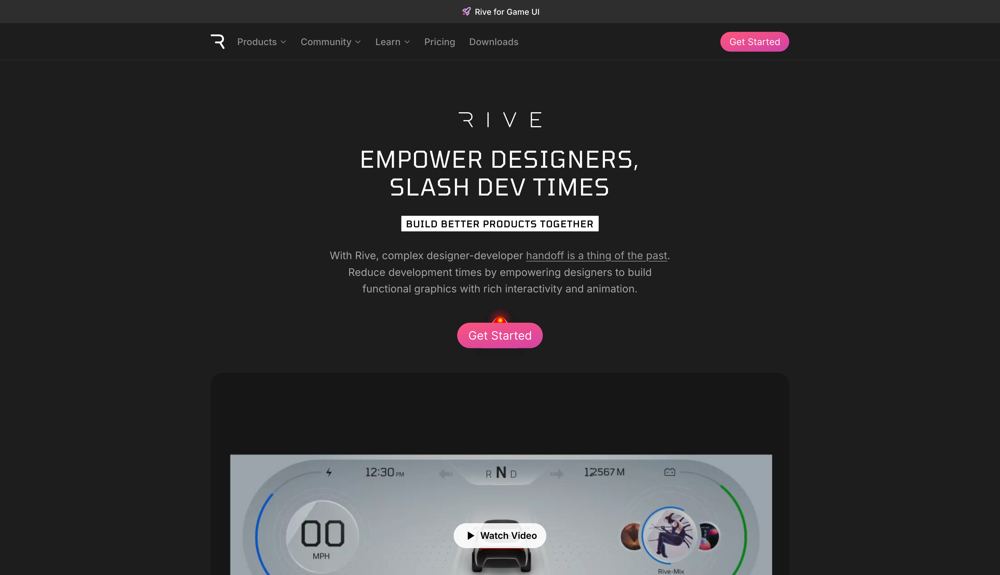
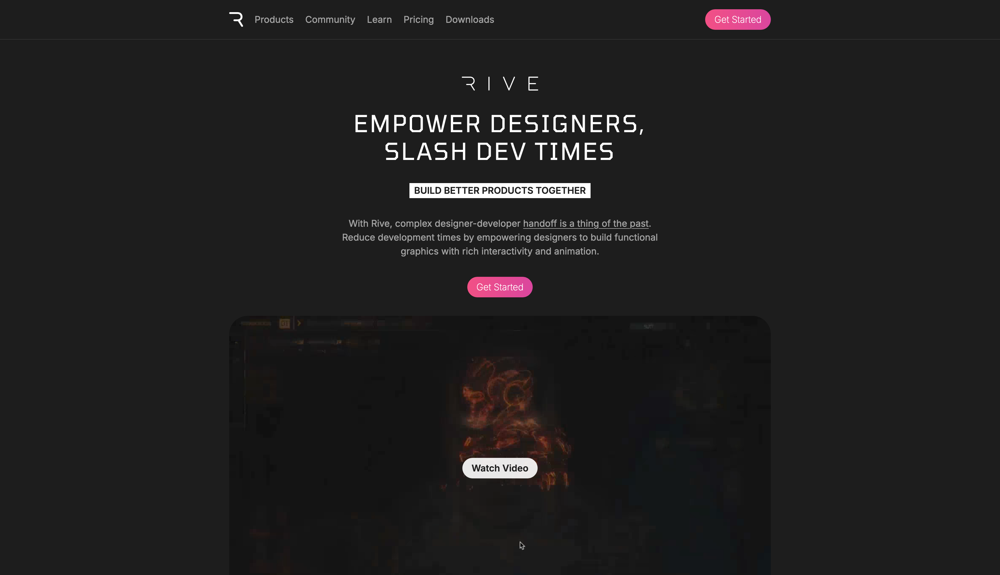

# Cloned landing page September 2024

This repo is a reference for the lecture I gave for UpLeveled.

During the limited 3 hours of this practical lecture we setup the project and cloned a few sections of the landingpage https://rive.app/ in React, utilizing CSS Modules and tackling some common CSS layout problems.

## Original design

## Recreated end result

## Run locally

In the project directory, you can run:

### `pnpm start`

Runs the app in the development mode.\
Open [http://localhost:3000](http://localhost:3000) to view it in your browser.

The page will reload when you make changes.\
You may also see any lint errors in the console.

### References

- https://developer.mozilla.org/en-US/docs/Web/CSS/box-sizing
- https://glenmaddern.com/articles/css-modules
- https://www.landingfolio.com/
